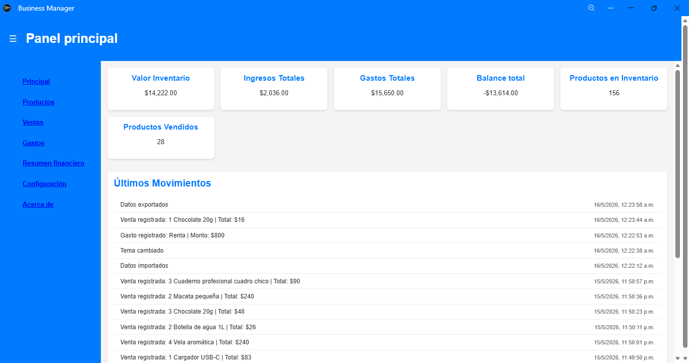
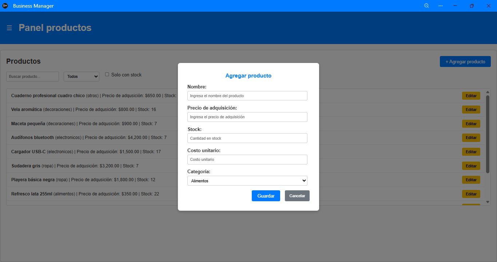
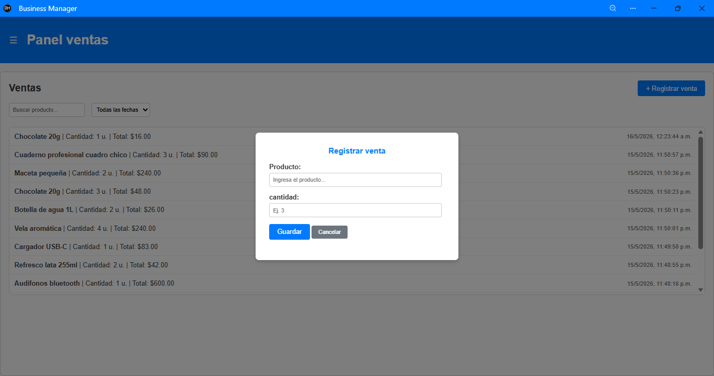
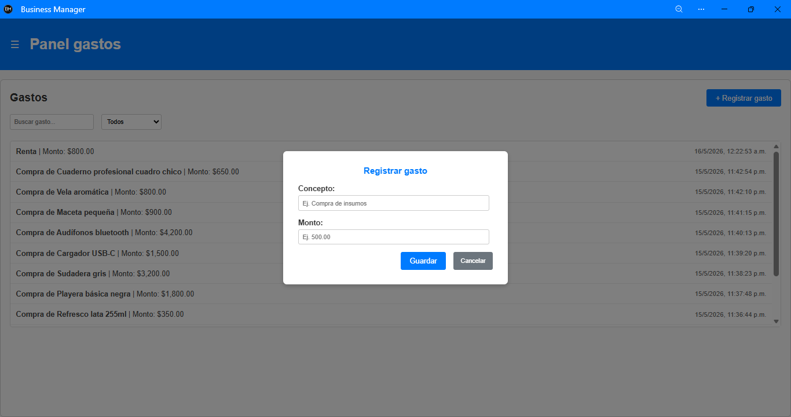
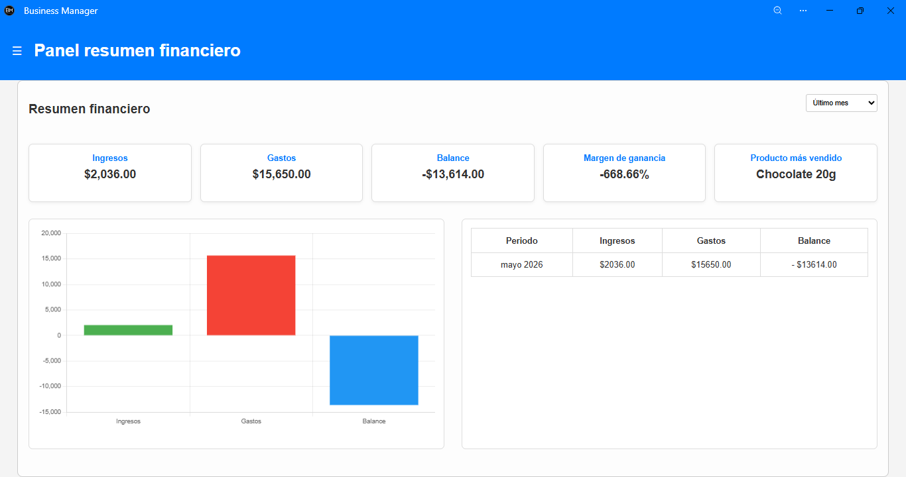
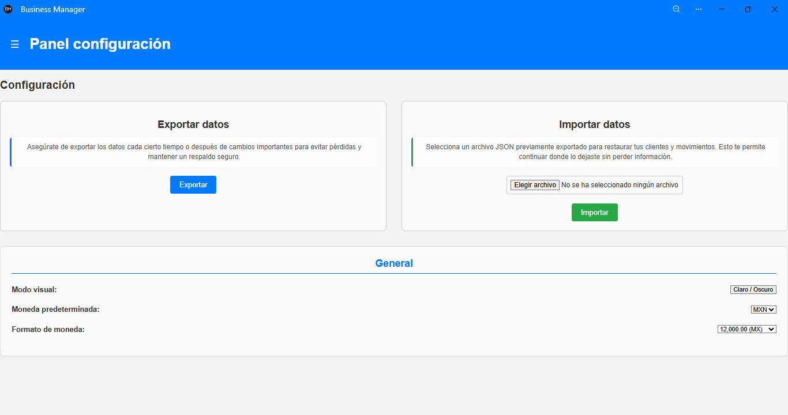

# Business Manager

Aplicación web progresiva (PWA) desarrollada con JavaScript vanilla para la gestión básica de inventario, ventas y gastos.

Permite administrar productos, registrar ventas, gastos y visualizar métricas financieras mediante gráficos y KPIs interactivos.

---

## Descripción

**Business Manager** es una aplicación enfocada en pequeños negocios o emprendimientos que necesitan una herramienta simple para llevar control de productos, movimientos financieros y estado general del negocio.

La aplicación funciona completamente del lado del cliente utilizando:

- localStorage para persistencia de datos
- JavaScript modular
- Service Workers para funcionamiento offline
- Chart.js para visualización gráfica

No requiere backend ni instalación de servidores externos.

---

## Características principales

### Gestión de productos
- Agregar productos
- Editar productos
- Eliminar productos
- Categorías
- Control de stock
- Validación de productos duplicados
- Registro automático de gastos de adquisición

### Ventas
- Registro de ventas
- Descuento automático del stock
- Cálculo automático del total vendido
- Filtros por fecha
- Historial de ventas

### Gastos
- Registro de gastos generales
- Filtros por fecha
- Historial de gastos

### Dashboard principal
- Valor total del inventario
- Ingresos totales
- Gastos totales
- Balance general
- Total de productos vendidos
- Total de productos en inventario
- Últimos movimientos realizados en la app

### Resumen financiero
- Comparativas por periodos (último mes, trimestre o año)
- KPIs financieros (ingresos, gastos, balance, margen de ganancia y producto más vendido)
- Gráficos interactivos que se recalculan según el periodo elegido
- Tabla financiera mensual que se actualiza automáticamente con el filtro seleccionado


### Configuración
- Exportar datos a JSON
- Importar respaldos JSON
- Cambio de moneda
- Cambio de formato regional
- Modo oscuro / claro

### PWA (Progressive Web App)
- Instalación en dispositivos
- Funcionamiento offline básico
- Caché mediante Service Worker
- Iconos adaptables

---

## Tecnologías utilizadas

- HTML5
- CSS
- JavaScript ES Modules
- localStorage
- Service Workers
- PWA
- Chart.js

---

## Arquitectura del proyecto

### `app.js`
Inicialización general de la aplicación.

### `data.js`
Persistencia de datos y lógica de almacenamiento.

### `events.js`
Eventos y lógica de interacción del usuario.

### `style.css`
Diseño y animaciones de de la app.

### `ui.js`
Renderizado dinámico de la interfaz.

### `sw.js`
Service Worker para caché offline.

### `manifest.json`
Configuración PWA.

### `resources`
- Iconos PWA (`icon-32.png`, `icon-192.png`, `icon-512.png`)

### `libs`
- `chart.umd.min.js` (librería Chart.js en versión empaquetada)

---

## Almacenamiento de datos

La aplicación utiliza `localStorage` del navegador.

Los datos incluyen:

- productos
- ventas
- gastos
- movimientos
- configuración visual
- moneda
- formato regional

---

## Advertencia

Los datos se almacenan únicamente en el navegador.  
La información puede perderse si:

- Se borra la caché o almacenamiento local
- Se cambia de navegador
- Se usa otro dispositivo
- Se reinstala el navegador

Se recomienda exportar respaldos periódicamente.

---

## Instalación y ejecución

### Clonar repositorio

```bash
git clone https://github.com/Mario-zs/BusinessManager.git
```

---

### Ejecutar localmente

Debido al uso de módulos ES y Service Workers, se recomienda utilizar un servidor local.

Ejemplo con Visual Studio Code + Live Server.

---

### Demo

Puedes probar la aplicación aquí:

👉 https://mario-zs.github.io/BusinessManager/

---

### Capturas de pantalla

#### Dashboard principal


#### Productos


#### Ventas


#### Gastos


#### Resumen financiero


#### Configuración


---

### Características técnicas destacadas
- Arquitectura modular
- Persistencia local
- Exportación e importación de datos
- PWA instalable
- Soporte offline
- Modo oscuro
- Formato monetario configurable
- Responsive design
- Renderizado dinámico
- Validaciones de formularios

---

### Licencia

MIT License

Desarrollado por Mario Alberto Melgarejo Villaseñor © 2026